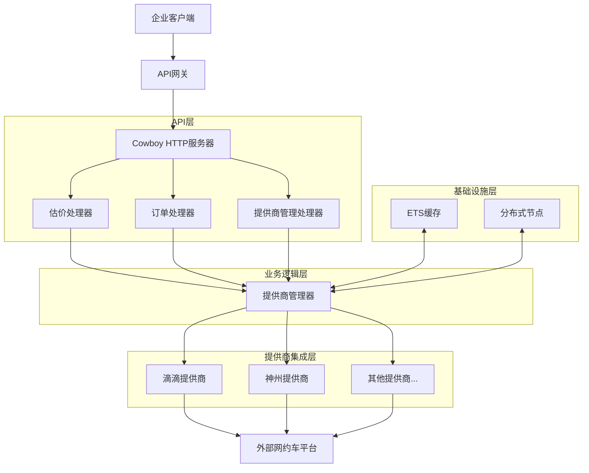
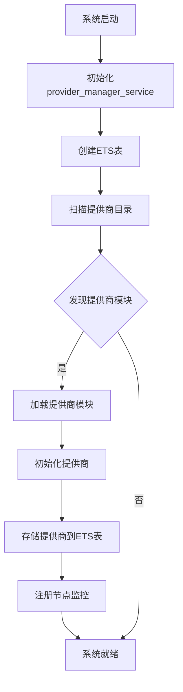
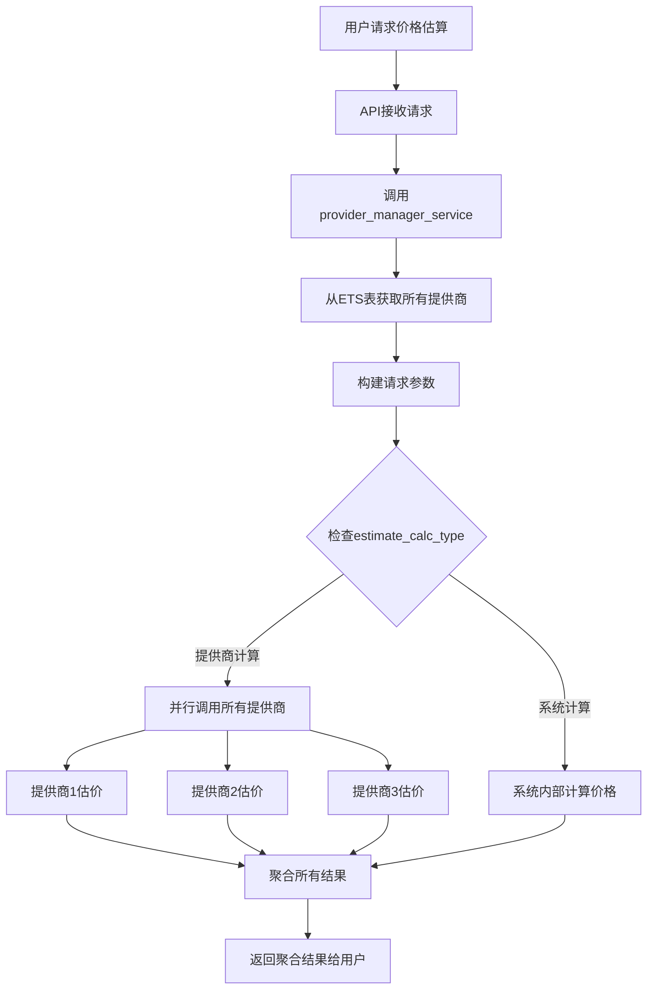
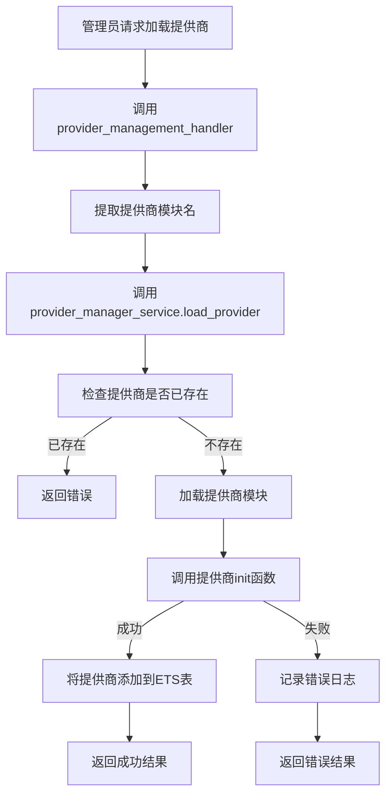
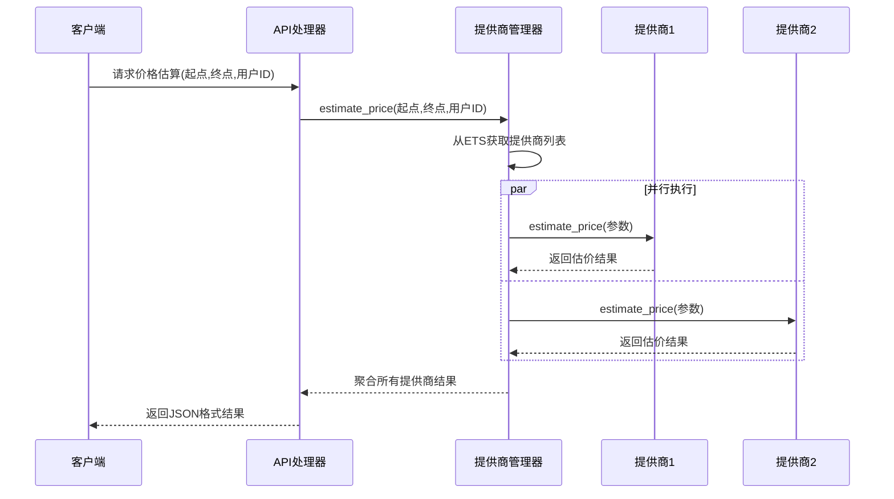
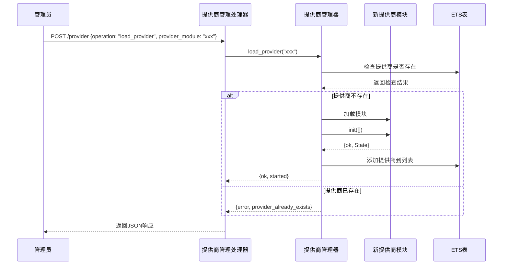

# 企业网约车后台服务系统分析文档

## 1. 项目概述

该项目是一个为企业用户提供的网约车后台服务，采用Erlang语言开发。系统核心功能是整合多个第三方网约车平台（如滴滴、神州等）的运力资源，为企业用户提供统一的API接口，实现一站式网约车服务。

### 1.1 主要功能

- 多运力提供商动态管理（热插拔）
- 统一价格预估接口
- 提供商自动发现与加载
- 分布式节点支持
- RESTful API接口

### 1.2 技术栈

- 编程语言: Erlang
- Web服务器: Cowboy
- 状态管理: ETS表
- 并发处理: Erlang原生并发
- 数据交换格式: JSON (JSX库)

## 2. 系统架构

系统采用分层架构设计，主要包含以下几个层次：

1. **API层**: 提供HTTP接口，处理外部请求
2. **业务逻辑层**: 核心业务逻辑处理
3. **提供商集成层**: 对接不同的运力提供商
4. **基础设施层**: 系统配置、监控等支持功能

### 2.1 系统架构图

## 3. 核心模块分析

### 3.1 提供商管理器 (provider_manager_service)

提供商管理器是系统的核心组件，负责管理所有运力提供商，并提供统一的接口供其他模块调用。

**主要职责**:
- 动态加载/卸载运力提供商
- 自动发现并加载可用提供商
- 聚合多个提供商的价格预估结果
- 维护提供商状态和配置信息
- 根据计算类型决定价格计算方式

**实现机制**:
- 实现为gen_server行为模式
- 使用ETS表存储提供商配置和状态
- 支持分布式节点监控
- 提供并行处理能力
- 支持多种价格计算策略

### 3.2 提供商管理API处理器 (provider_management_handler)

提供商管理API处理器负责处理与提供商管理相关的HTTP请求，实现了提供商的热插拔功能。

**主要功能**:
- 列出所有可用的提供商
- 动态加载新的提供商
- 动态卸载现有提供商
- 重新加载所有提供商

### 3.3 提供商模块 (sub_providers)

每个具体的运力提供商都实现为单独的Erlang模块，遵循统一的接口规范。

**统一接口**:
- init/1: 初始化提供商
- estimate_price/1: 预估行程价格

**命名规范**:
- 所有提供商模块名以_provider.erl结尾

## 4. 关键流程分析

### 4.1 系统启动流程

### 4.2 价格估算流程

价格估算是系统的核心功能之一。系统根据`estimate_calc_type`参数决定价格计算方式：
1. **系统计算模式**：由系统内部基于距离、时间等因素计算价格，适用于简单行程或特定场景
2. **提供商计算模式**：调用各运力提供商API获取实时价格，适用于需要准确报价的场景

这种灵活设计使系统能够在性能和准确性之间取得平衡，对于简单路线可以快速响应，对于复杂路线则保证价格准确性。

### 4.3 提供商动态加载流程

## 5. 系统时序图

### 5.1 价格估算时序图

### 5.2 提供商加载时序图

## 6. 项目亮点与优势

### 6.1 技术亮点

1. **热插拔架构**: 系统支持在不重启的情况下动态加载和卸载提供商模块
2. **高并发处理**: 利用Erlang的并发特性，并行调用多个提供商API
3. **容错设计**: 单个提供商失败不影响整体系统功能
4. **分布式支持**: 利用Erlang的分布式特性，支持跨节点部署
5. **ETS高性能缓存**: 使用ETS表存储提供商信息，提供高性能的读写操作

### 6.2 业务价值

1. **统一接入**: 企业用户只需对接一个系统，即可使用多家网约车平台服务
2. **价格比较**: 同时获取多个平台的价格估算，便于选择最优方案
3. **灵活扩展**: 可以根据需求动态添加新的运力提供商
4. **运营管控**: 提供统一的管理接口，便于企业进行用车管控

## 7. 潜在优化方向

1. **负载均衡**: 基于提供商响应时间和成功率实现智能路由
2. **缓存机制**: 对常用路线价格预估结果进行缓存
3. **监控告警**: 增加提供商健康检查和性能监控
4. **数据分析**: 添加用车数据分析功能，为企业提供决策支持
5. **安全增强**: 增加API认证和权限控制机制

## 8. 总结

该企业网约车后台服务系统采用Erlang语言开发，基于OTP框架设计，具有高并发、高可用、可扩展的特点。系统通过提供商管理器统一管理多个运力提供商，为企业用户提供统一的API接口。

系统的核心价值在于整合多家网约车平台资源，简化企业用户的对接流程，提供更灵活、更经济的用车解决方案。通过动态提供商管理，系统可以快速适应市场变化，集成新的运力资源。 