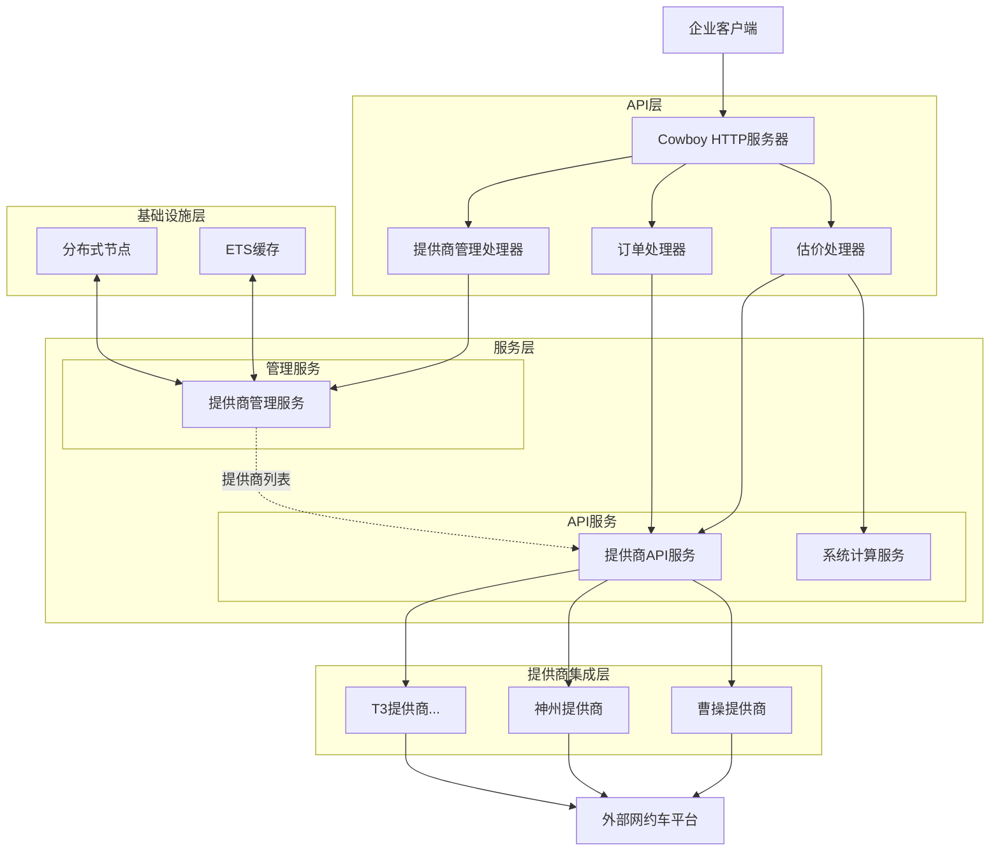
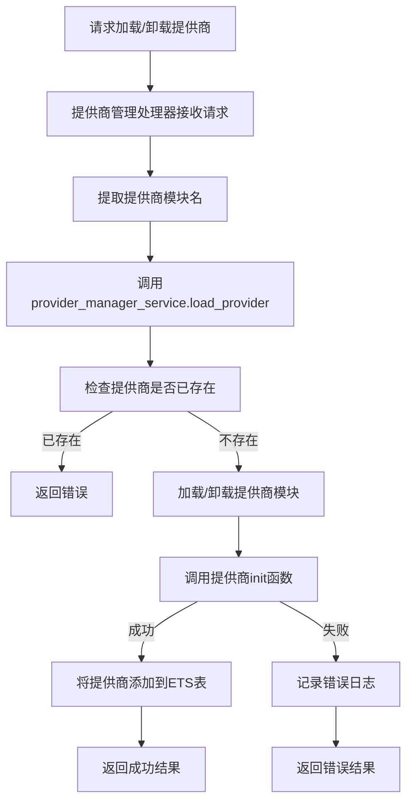
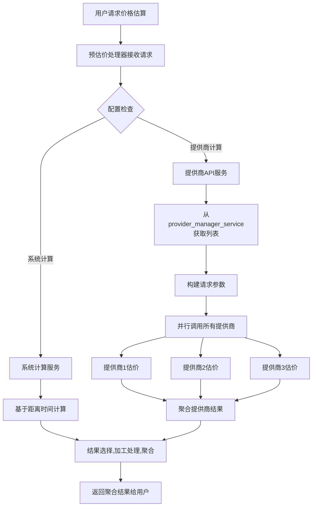
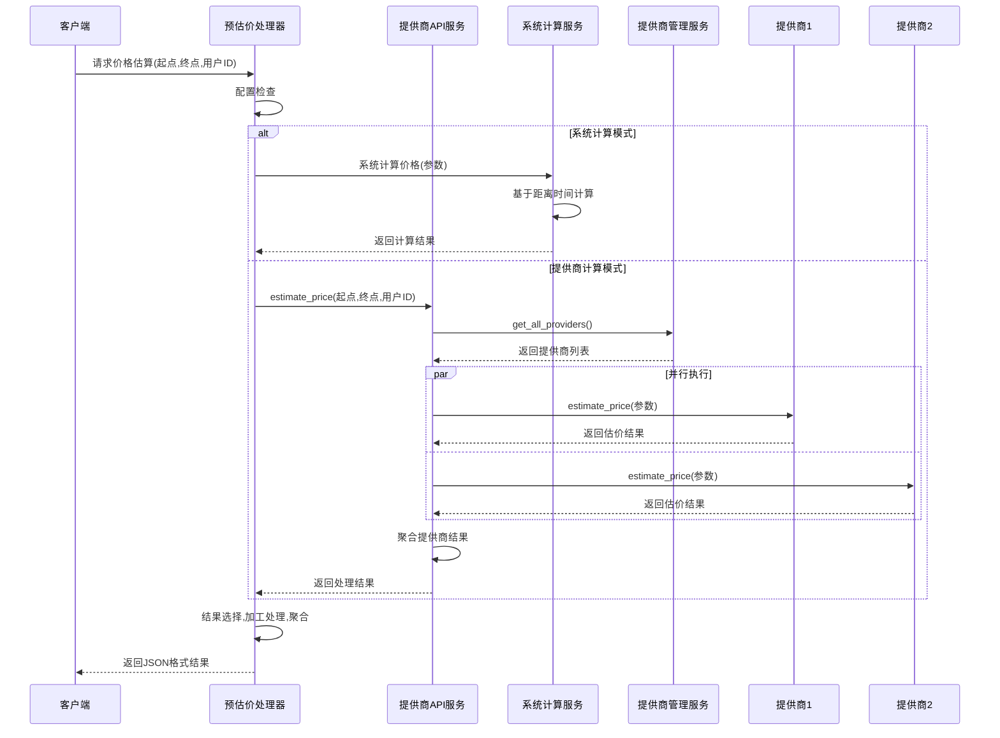

---
html:
  toc: true 
---
# 企业网约车后台服务系统分析文档

## 项目概述
该项目是一个为企业用户提供的网约车后台服务，采用Erlang语言开发。系统核心功能是整合多个第三方网约车平台（如曹操, 神州, T3等）的运力资源，为企业用户提供统一的API接口，实现一站式网约车服务。

### 主要功能
- 分布式节点支持
- 多运力提供商动态管理（热插拔）
- Restful API接口
  - 预估价接口
  - 下单
  - ... // TODO

### 技术栈
- 编程语言: Erlang
- Web服务器: Cowboy
- 状态管理: ETS表
- 并发处理: Erlang原生并发
- 数据交换格式: JSON (JSX库)

## 系统架构
系统采用分层架构设计，主要包含以下几个层次：
- **API层**: 提供HTTP接口，处理外部请求
- **服务层**: 核心业务逻辑处理
    - **管理服务**: 负责提供商的生命周期管理（热插拔）
    - **API服务**: 负责与提供商的实际交互
- **提供商集成层**: 对接不同的运力提供商
- **基础设施层**: 系统配置、监控等支持功能 

### 系统架构图

## 核心模块

### 运力提供商管理服务 (provider_manager_service)
提供商管理服务是系统的管理组件，**专门负责运力提供商的生命周期管理**。

**主要功能**:
- 列出所有可用的提供商
- 动态加载新的提供商
- 动态卸载现有提供商
- 重新加载所有提供商

### 运力提供商API服务 (provider_api_service)

提供商API服务负责与各运力提供商进行实际交互，**专门处理所有业务逻辑调用**。

**主要功能**:
- 调用所有运力提供商的预估价接口
- 调用运力提供商的订单创建、查询等业务接口
- 并行处理多个提供商的请求
- 聚合多个提供商的结果
- 处理API调用异常和超时情况

### 运力提供商模块 (sub_providers)

每个具体的运力提供商都实现为单独的Erlang模块，遵循统一的接口规范。

**统一接口**:
- init/1: 初始化提供商
- estimate_price/1: 预估行程价格
- create_order/1: 创建订单
- query_order/1: 查询订单状态

**命名规范**:
- 所有提供商模块名以_provider.erl结尾

## 系统流程图

### 提供商动态加载流程

### 预估价流程

## 系统时序图

### 价格估算时序图

### 下单时序图
...

## 重构记录

通过多轮重构，项目获得了显著改进：
 **明确的职责划分**：
   - provider_manager_service专注于提供商的热插拔管理
   - provider_api_service专注于业务逻辑调用和结果处理

## 潜在优化方向

**负载均衡**: 基于提供商响应时间和成功率实现智能路由
**缓存机制**: 对常用路线价格预估结果进行缓存
**监控告警**: 增加提供商健康检查和性能监控
**数据分析**: 添加用车数据分析功能，为企业提供决策支持
**安全增强**: 增加API认证和权限控制机制